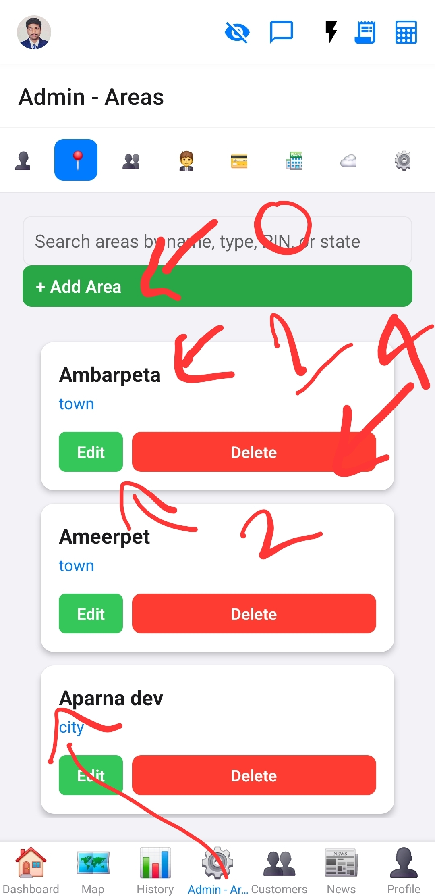
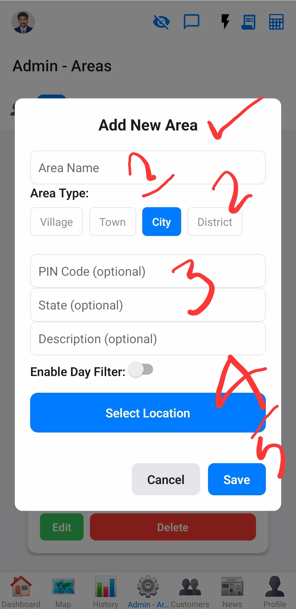
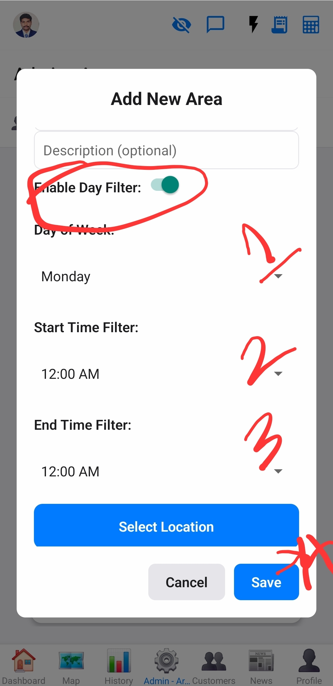
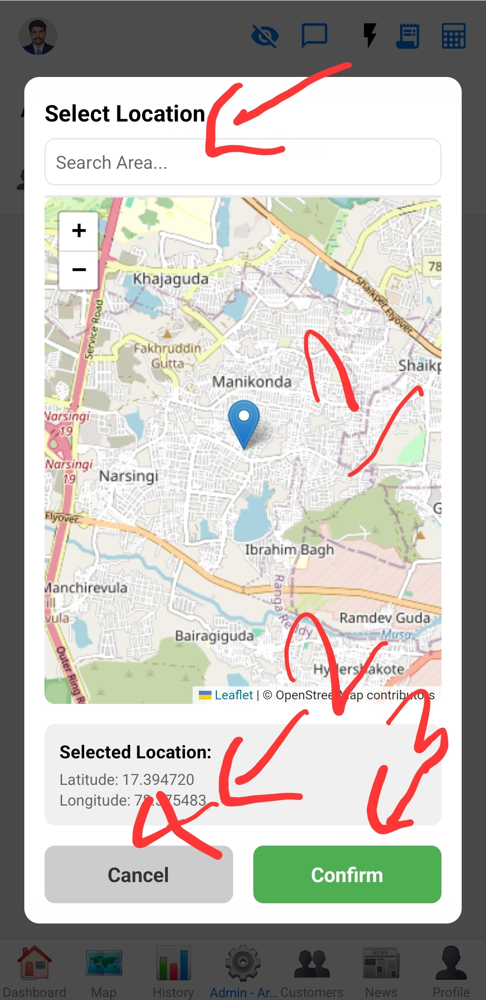

# Area Management

This document describes the area management section within the Admin screen.

## Overview
This section allows administrators to define and manage geographical areas, including their types, pin codes, and time-based filtering.

## Functionality
*   **View Areas:** Displays a list of all defined areas.
*   **Add New Area:** Create new areas with properties like name, type (city, etc.), PIN code, state, and description.
*   **Location Filtering:** Configure areas to be active only on specific days and times.
*   **Map Integration:** Allows selecting a precise location on a map for the area.
*   **Edit/Delete Areas:** Modify existing area details or remove them.

## Images

