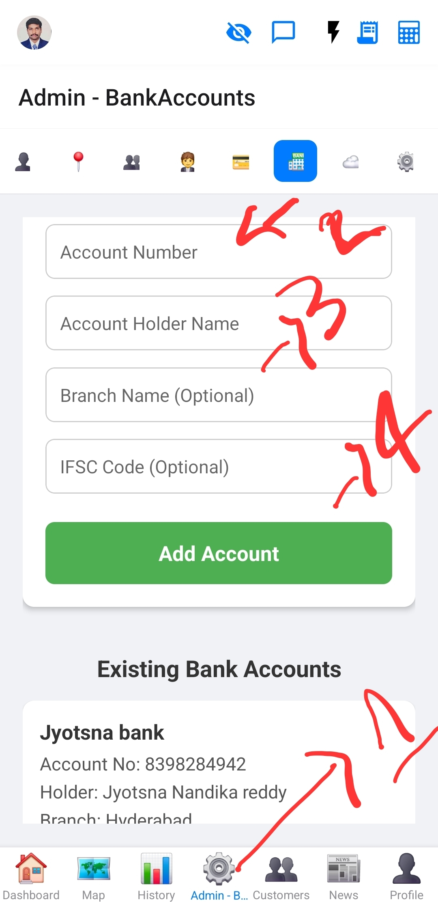

# Bank Accounts Management

This document describes the bank accounts management section within the Admin screen.

## Overview
This section allows administrators to manage bank account details.

## Functionality
*   **View Bank Accounts:** Displays a list of all configured bank accounts.
*   **Add New Account:** Allows adding new bank account details.
*   **Edit/Delete Accounts:** Modify existing bank account information or remove them.

## Images

