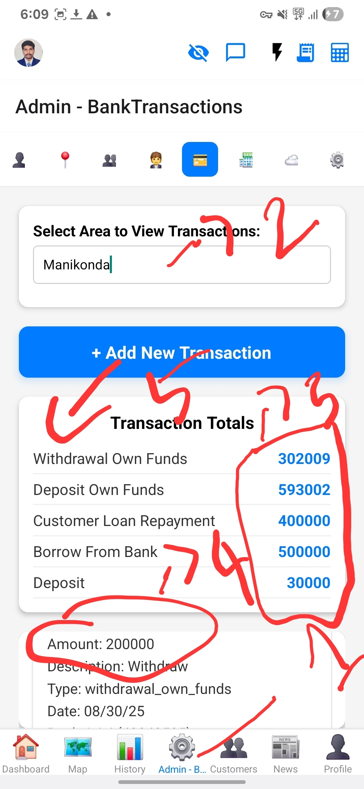
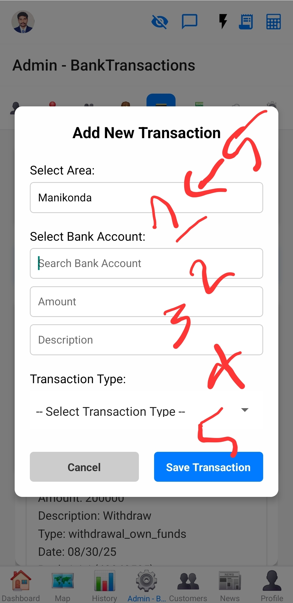
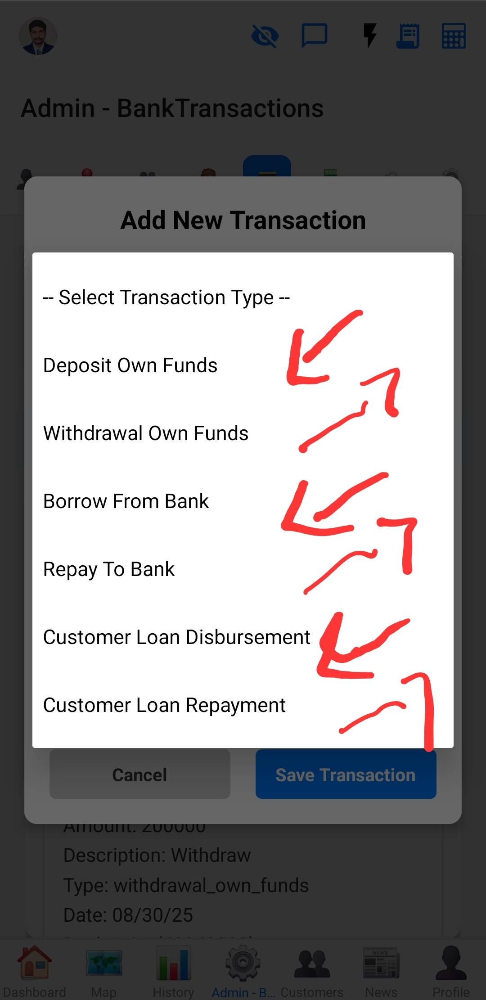

# Bank Transactions Management

This document describes the bank transactions management section within the Admin screen.

## Overview
This section allows administrators to view and manage bank transaction data, including bulk uploads.

## Functionality
*   **View Transactions:** Displays a list of bank transactions.
*   **Bulk Upload:** Allows uploading transaction data from a CSV file.
    *   Required columns: `card_no`, `amount`, `transaction_date`, `payment_mode`, `remarks`.

## Images

