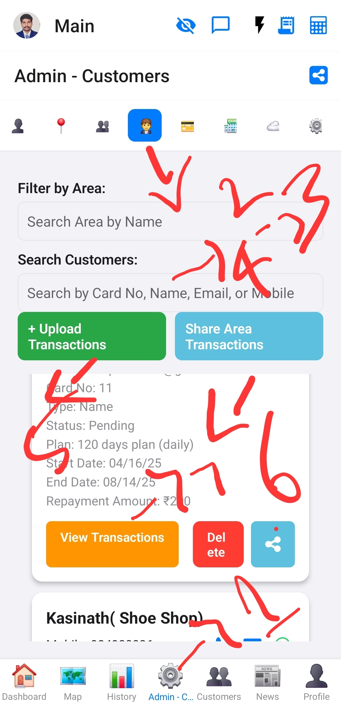
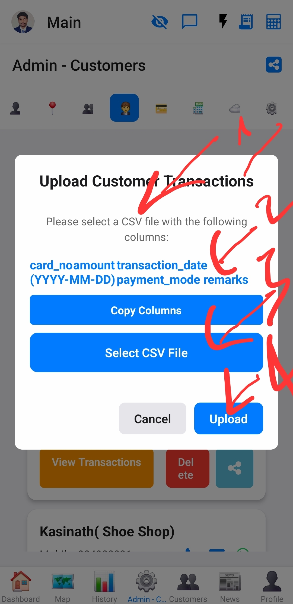

# Data Uploads

This document describes the data upload section within the Admin screen.

## Overview
This section allows administrators to perform bulk data uploads for customers, customer transactions, and expenses via CSV files.

## Functionality
*   **Customer Uploads:** Upload new customer data from a CSV file.
    *   Required columns: `name`, `mobile`, `email`, `cardno`, `customer_type`, `start_date (YYYY-MM-DD)`, `amount_given`, `repayment_amount`, `repayment_frequency`, `periods`.
*   **Customer Transaction Uploads:** Upload customer transaction records from a CSV file.
    *   Required columns: `card_no`, `amount`, `transaction_date (YYYY-MM-DD)`, `payment_mode`, `remarks`.
*   **Expense Uploads:** Upload expense records from a CSV file.
    *   Required columns: `amount`, `remarks`, `date (YYYY-MM-DD)`, `expense_type`.

## Images

