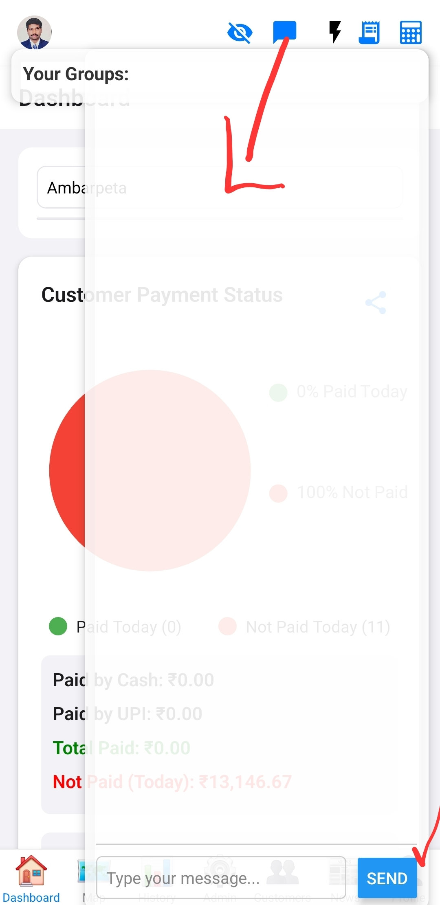

# Global Chat and Presence

This feature provides a global chat system and presence indicators, allowing users to communicate and see who is online.

## Overview

Enables real-time messaging and displays the online status of users within the application.

## Key Components/Services Involved

*   [`GlobalChatAndPresence.js`](../../src/components/GlobalChatAndPresence.js) (component): Manages the chat interface and presence logic.
*   Supabase Realtime: Powers the real-time messaging and presence tracking.

## Functionality

*   **Real-time Messaging:** Users can send and receive messages instantly.
    
*   **User Presence:** Displays which users are currently online or active.
    
*   **Group Selection:** (If implemented) Allows users to select different chat groups or channels.
    

## Implementation Details

*   Leverages Supabase Realtime subscriptions for chat messages and presence updates.
*   Can be toggled on/off via a header button.

