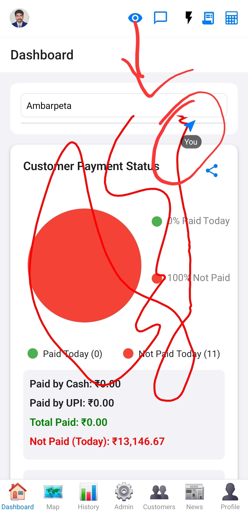

# Realtime Collaboration

This feature enables real-time collaborative functionalities within the application, allowing multiple users to interact simultaneously.

## Overview

Leverages Supabase Realtime capabilities to provide instant updates and shared experiences across different user sessions.

## Key Components/Services Involved

*   [`RealtimeCollaboration.js`](../../src/components/RealtimeCollaboration.js) (component): Manages the real-time connection and shared state.
*   Supabase Realtime: The backend service providing WebSocket connections for real-time data synchronization.

## Functionality

*   **Shared State Synchronization:** Updates made by one user are immediately reflected for others in the same collaborative session.
    
*   **Presence Indicators:** Shows which users are currently active or present in a collaborative space.
    
*   **Realtime Cursor Display:** (If implemented) Shows the cursors of other users in real-time.
    

## Implementation Details

*   Utilizes Supabase channels for broadcasting and listening to real-time events.
*   Can be toggled on/off via a header button.

