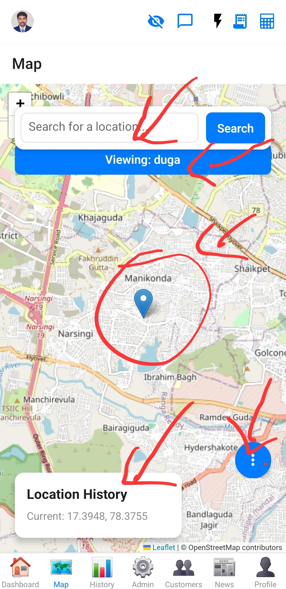

# Map Screen

This screen provides a map interface, likely for tracking or displaying real-time locations.

## Purpose

To visualize geographical data, such as user locations or customer points of interest.

## Components

*   Interactive map (e.g., LeafletMap).
*   Markers for locations.
*   Controls for map interaction (zoom, pan).

