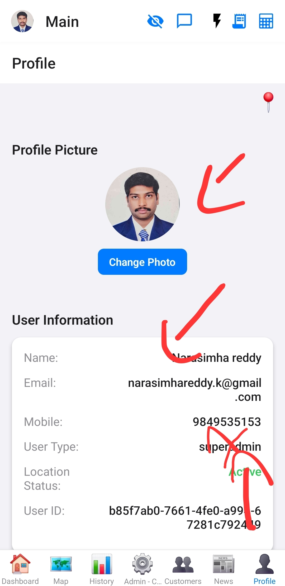

# Profile Screen

This screen allows users to view and manage their personal profile information.

## Purpose

To provide users with a dedicated section to update their details, change passwords, or manage other profile-related settings.

## Components

*   Display of user details (e.g., name, email, profile photo).
*   Options to edit profile information.
*   Logout button.

